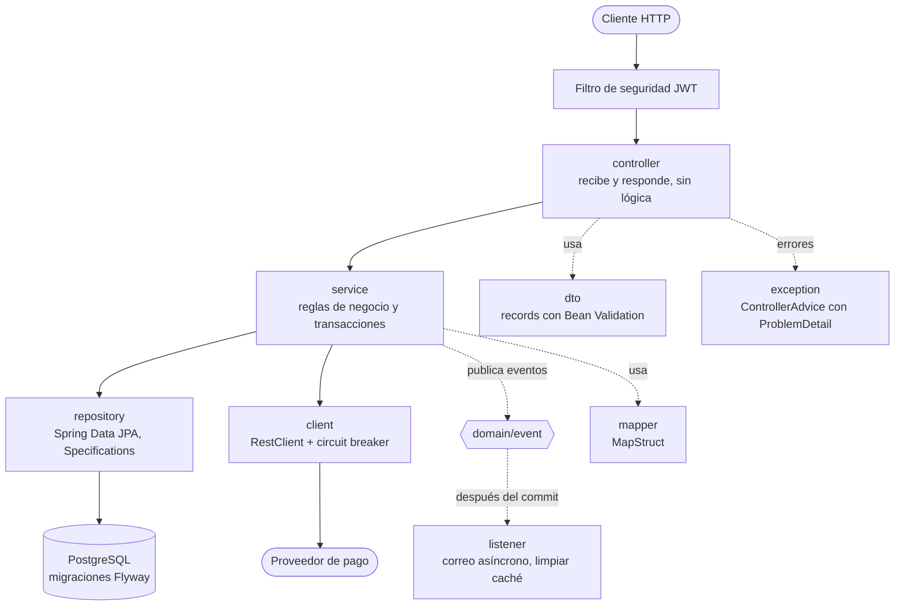
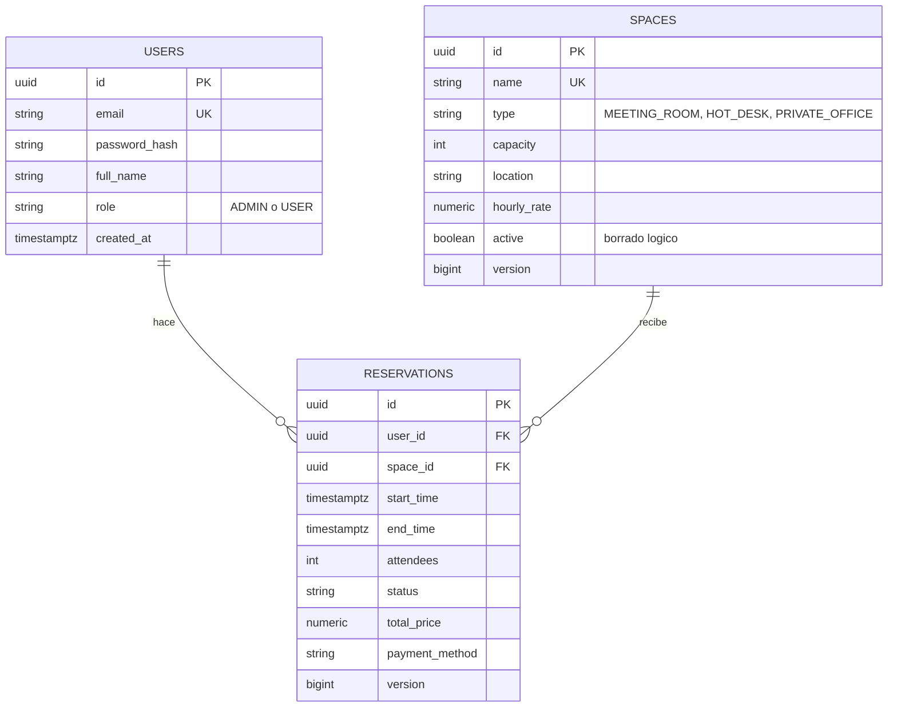
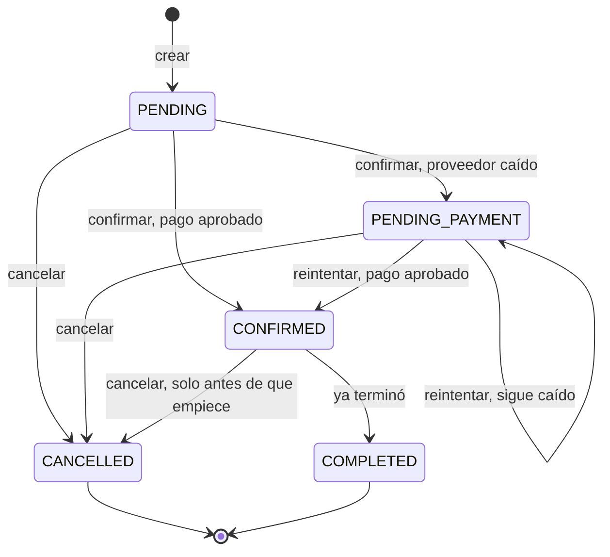

# Coworking Reservations

API REST para gestionar reservas de espacios de coworking (salas de reuniones, puestos de trabajo y oficinas privadas). Incluye autenticación con JWT y roles, control de solapamientos incluso bajo concurrencia, validación de pago contra un proveedor externo protegido con un circuit breaker, notificaciones asíncronas y un reporte de ocupación con caché.

Está pensada como una base lista para producción, no como un prototipo: migraciones versionadas, errores estandarizados, configuración por perfiles, observabilidad con Actuator, documentación OpenAPI y pruebas contra una base PostgreSQL real.

---

## Contenido

1. [Alcance](#1-alcance)
2. [Stack](#2-stack)
3. [Cómo ejecutar](#3-cómo-ejecutar)
4. [Arquitectura](#4-arquitectura)
5. [Modelo de dominio y ciclo de vida de la reserva](#5-modelo-de-dominio-y-ciclo-de-vida-de-la-reserva)
6. [Justificación de los requisitos técnicos](#6-justificación-de-los-requisitos-técnicos)
7. [Concurrencia y transacciones](#7-concurrencia-y-transacciones)
8. [Resiliencia: circuit breaker](#8-resiliencia-circuit-breaker)
9. [Patrones de diseño](#9-patrones-de-diseño)
10. [Decisiones y trade-offs](#10-decisiones-y-trade-offs)
11. [Fuera de alcance y mejoras con más tiempo](#11-fuera-de-alcance-y-mejoras-con-más-tiempo)

---

## 1. Alcance

| Requisito del enunciado | Estado |
|---|---|
| CRUD de espacios (nombre, tipo, capacidad, ubicación, tarifa por hora) | Hecho, con borrado lógico, filtros y paginación |
| Registro y autenticación con roles ADMIN y USER | Hecho, JWT stateless |
| Un USER crea, consulta y cancela sus reservas; un ADMIN gestiona todas | Hecho |
| Sin reservas solapadas en el mismo espacio | Hecho en dos capas: lock pesimista y constraint de base de datos |
| Notificación asíncrona al confirmar, sin bloquear la respuesta | Hecho con eventos de dominio y `@Async` |
| Reporte de ocupación (%) por espacio y rango de fechas, cacheado | Hecho, una sola consulta agregada y caché Caffeine |
| Validación de pago externa, tratada como inestable | Hecho con WireMock, timeouts y circuit breaker |

Endpoints principales (prefijo `/api/v1`):

| Método y ruta | Quién | Descripción |
|---|---|---|
| `POST /auth/register`, `POST /auth/login`, `GET /auth/me` | público, público, autenticado | Registro (siempre rol USER), login y datos propios |
| `GET /spaces`, `GET /spaces/{id}` | autenticado | Lista paginada con filtros `type`, `minCapacity`, `location`, `active` |
| `POST /spaces`, `PUT /spaces/{id}`, `DELETE /spaces/{id}` | ADMIN | Crear, actualizar y desactivar (borrado lógico) |
| `POST /reservations`, `GET /reservations`, `GET /reservations/{id}` | autenticado | Crear, listar con filtros `status`, `spaceId`, `from`, `to`, `userId` (este solo ADMIN) y ver |
| `POST /reservations/{id}/confirm` | dueño o ADMIN | Valida el pago: 200, 202 o 402 |
| `POST /reservations/{id}/cancel` | dueño o ADMIN | Cancela |
| `POST /reservations/{id}/complete` | ADMIN | Completa una reserva confirmada que ya terminó |
| `GET /reports/occupancy?from=&to=` | ADMIN | Ocupación por espacio |

Además: `/actuator/health`, `/actuator/info`, `/actuator/metrics`, `/actuator/circuitbreakers`, `/actuator/circuitbreakerevents`, y Swagger UI en `/swagger-ui/index.html`.

---

## 2. Stack

| Componente | Versión |
|---|---|
| Java | 21 (LTS) |
| Spring Boot | 3.5.16 (línea 3.x, como pide el enunciado) |
| Spring Cloud (solo para el circuit breaker) | 2025.0.3 |
| Persistencia | Spring Data JPA con Hibernate 6.6 y PostgreSQL 16 |
| Migraciones | Flyway 11.7 |
| Seguridad | Spring Security con `oauth2-resource-server` (Nimbus JOSE, HS256) |
| Resiliencia | Resilience4j (vía `spring-cloud-starter-circuitbreaker-resilience4j`) |
| Caché | Caffeine 3.2 |
| Documentación | springdoc-openapi 2.8.17 |
| Mapeo entidad a DTO | MapStruct 1.6.3 |
| Pruebas | JUnit 5, Mockito, AssertJ, Testcontainers 1.21, WireMock 3.13, Awaitility 4.3, JaCoCo 0.8.15 |
| Contenedores | Docker, imagen final `eclipse-temurin:21-jre-alpine` |

---

## 3. Cómo ejecutar

### 3.1 Con Docker (recomendado, el único requisito es Docker)

```bash
docker compose up --build
```

Levanta tres contenedores: **PostgreSQL**, **WireMock** (el proveedor de pago falso) y la **aplicación**. La primera vez descarga imágenes y compila, así que tarda unos minutos, y el arranque de la aplicación toma entre uno y dos minutos. El servicio `app` solo se marca como saludable cuando `/actuator/health` responde `UP`.

No hace falta crear ningún archivo `.env`: cada variable tiene un valor por defecto razonable.

| Qué | URL |
|---|---|
| API | http://localhost:8080/api/v1 |
| Swagger UI | http://localhost:8080/swagger-ui/index.html |
| Health | http://localhost:8080/actuator/health |
| WireMock, stubs cargados | http://localhost:8089/__admin/mappings |
| WireMock, peticiones recibidas | http://localhost:8089/__admin/requests |

**Credenciales de demo.** Al arrancar se crea de forma idempotente un administrador:

| Usuario | Contraseña | Rol |
|---|---|---|
| `admin@coworking.local` | `Admin1234!` | ADMIN |

Cualquier usuario que se registre por la API tiene rol USER.

Para empezar de cero, borrando también los datos: `docker compose down -v`.

**Si un puerto está ocupado**, se puede cambiar sin tocar archivos: `APP_PORT=9090 WIREMOCK_PORT=9089 docker compose up --build`. El compose no publica el puerto de PostgreSQL a propósito, para que no choque con una base local; la aplicación lo alcanza por la red interna de Docker.

### 3.2 Tokens de pago de la demo

El proveedor de pago es un WireMock con respuestas deterministas, elegidas por el campo `paymentMethod` de la reserva. Los stubs están en [`wiremock/mappings`](wiremock/mappings).

| `paymentMethod` | Qué hace el proveedor | Resultado al confirmar |
|---|---|---|
| `tok_ok` | Aprueba | 200, reserva `CONFIRMED` |
| `tok_declined` | Rechaza con `INSUFFICIENT_FUNDS` | 402, la reserva sigue `PENDING` |
| `tok_error` | Responde 500 | 202, reserva `PENDING_PAYMENT` |
| `tok_slow` | Tarda 5 s, más que el timeout de 3 s de la app | 202, reserva `PENDING_PAYMENT` |
| `tok_flaky` | Alterna: respuesta lenta, conexión cortada, error 500 | Varía en cada llamada |
| cualquier otro | Rechaza con `INVALID_PAYMENT_METHOD` | 402 |

### 3.3 Ejemplos de uso

[`requests/coworking.http`](requests/coworking.http) contiene todos los endpoints con ejemplos de éxito y de error, incluida la demo del circuit breaker paso a paso. Está escrito para la extensión **REST Client** de VS Code (`humao.rest-client`): los tokens y los ids se guardan solos entre peticiones y las fechas se calculan automáticamente para que las reservas siempre queden en el futuro.

### 3.4 Desarrollo local con el perfil `dev`

Para correr la aplicación fuera de Docker (por ejemplo, desde el IDE) hace falta publicar PostgreSQL en tu máquina. Para eso hay un archivo de compose aparte:

```bash
docker compose -f docker-compose.yml -f docker-compose.dev.yml up -d postgres wiremock
./mvnw spring-boot:run
```

El perfil `dev` es el que se activa por defecto y se conecta a `localhost:${POSTGRES_PORT:5432}`. Si tu puerto 5432 está ocupado por otro PostgreSQL, define `POSTGRES_PORT` (por ejemplo `5433`) tanto para el compose como para la aplicación.

### 3.5 Pruebas

```bash
./mvnw verify
```

Requiere Docker encendido, porque las pruebas de integración levantan un PostgreSQL real con Testcontainers. Tarda unos 6 minutos. El reporte de cobertura queda en `target/site/jacoco/index.html`.

Resultado actual: **250 pruebas, todas en verde**, con **98.4 % de cobertura de líneas** y 87.7 % de ramas.

| Tipo | Qué cubre |
|---|---|
| Unitarias (Mockito) | Servicios, patrón State con **toda** la matriz de transiciones, cliente de pago y su fallback, cálculo de precio, reporte, JWT, manejo de errores |
| `@WebMvcTest` | Validación (400 con un error por campo), seguridad (401 y 403) y traducción de resultados a HTTP |
| Integración (PostgreSQL con Testcontainers y WireMock) | Concurrencia con 10 hilos, ciclo completo del circuit breaker, notificación asíncrona, caché del reporte, seguridad de punta a punta, CRUD de espacios, filtros de reservas, Actuator y OpenAPI |

### 3.6 Configuración

Toda la configuración sale de `@ConfigurationProperties` (records validados con `@Validated`). No hay `@Value` en el código. Los perfiles son `dev` (por defecto) y `prod` (el que usa Docker, todo por variables de entorno). Variables principales del perfil `prod`:

| Variable | Default en el compose | Uso |
|---|---|---|
| `DB_URL`, `DB_USERNAME`, `DB_PASSWORD` | PostgreSQL del compose | Conexión a la base de datos |
| `JWT_SECRET` | secreto de demo de 40 caracteres | Firma de los tokens, mínimo 32 caracteres |
| `PAYMENT_BASE_URL` | `http://wiremock:8080` | Proveedor de pago |
| `ADMIN_EMAIL`, `ADMIN_PASSWORD`, `ADMIN_FULL_NAME` | admin de demo | Administrador inicial |
| `SWAGGER_ENABLED` | `true` | Ver más abajo |

> **Sobre `SWAGGER_ENABLED`.** Por defecto está encendido para que la demo muestre la documentación sin pasos extra. En un ambiente real se apaga con `SWAGGER_ENABLED=false`, porque exponer el contrato de la API en producción amplía la superficie de ataque. El secreto JWT de demo tampoco debe usarse fuera de una demo.

---

## 4. Arquitectura

Arquitectura en capas clásica, como pide el enunciado. Cada capa solo conoce a la de abajo.



```
com.coworking.reservations
├── config/          seguridad, async, caché, OpenAPI, cliente HTTP
│   └── properties/  records @ConfigurationProperties
├── controller/      @RestController, sin lógica de negocio
├── service/         interfaces y sus implementaciones, @Transactional aquí
├── repository/      Spring Data JPA, specifications y proyecciones
├── domain/
│   ├── entity/      entidades JPA
│   ├── enums/
│   ├── state/       patrón State del ciclo de vida
│   └── event/       eventos de dominio (records)
├── dto/             request y response, nunca se exponen entidades
├── mapper/          MapStruct
├── listener/        notificación asíncrona y limpieza de caché
├── client/          cliente del proveedor de pago
├── security/        JWT, handlers de 401 y 403, administrador inicial
├── scheduler/       job que marca reservas como completadas
└── exception/       excepciones de negocio y manejador global
```

**Manejo de errores.** Toda respuesta de error es `application/problem+json` (RFC 7807) con `type`, `title`, `status`, `detail`, `instance`, `timestamp` y un `code` estable. Las validaciones agregan `errors: [{field, message}]`. Los errores que genera la capa de seguridad (401 y 403) usan el mismo formato.

| Situación | HTTP | `code` |
|---|---|---|
| Datos inválidos, JSON roto, parámetro con tipo incorrecto, orden inválido | 400 | `VALIDATION_ERROR`, `MALFORMED_REQUEST`, `INVALID_PARAMETER`, `INVALID_SORT`, `INVALID_DATE_RANGE` |
| Sin token, token inválido o credenciales incorrectas | 401 | `UNAUTHORIZED`, `BAD_CREDENTIALS` |
| Pago rechazado | 402 | `PAYMENT_DECLINED` |
| Sin permisos | 403 | `ACCESS_DENIED` |
| No existe, o es de otro usuario | 404 | `RESOURCE_NOT_FOUND` |
| Solape, estado inválido, correo o nombre duplicado, modificación concurrente | 409 | `RESERVATION_OVERLAP`, `INVALID_RESERVATION_STATE`, `EMAIL_ALREADY_EXISTS`, `DUPLICATE_SPACE_NAME`, `CONCURRENT_UPDATE` |
| Reserva que rompe una regla de negocio | 422 | `INVALID_RESERVATION_REQUEST` |
| Cualquier otro error | 500 | `INTERNAL_ERROR`, sin stacktrace en la respuesta |

Se eligió **422 y no 400** para las reglas de negocio de las reservas (fechas en el pasado, duración, capacidad, espacio inactivo): el 400 queda para peticiones mal formadas, y el 422 para las bien formadas que violan una regla.

---

## 5. Modelo de dominio y ciclo de vida de la reserva



Los identificadores son UUID, para que no sean adivinables ni enumerables. Los montos son `BigDecimal` (`numeric(10,2)`) y las fechas se guardan en `timestamptz` y se devuelven siempre en UTC. Todas las relaciones son `LAZY`.



`CANCELLED` y `COMPLETED` son estados finales: cualquier acción posterior responde 409. Un `COMPLETED` se produce con el endpoint de administrador o con un job programado que cada 5 minutos marca las reservas confirmadas cuyo horario ya terminó.

---

## 6. Justificación de los requisitos técnicos

| Requisito | Dónde está | Por qué se usó así |
|---|---|---|
| **Spring Boot 3.x y Java 17+** | [`pom.xml`](pom.xml) | Boot 3.5 con Java 21 (LTS). Se evitó Boot 4.x porque el enunciado pide la línea 3.x. |
| **JPA bien modelado, `@Query`, Specifications, sin N+1** | Entidades en `domain/entity`; `ReservationRepository`; `SpaceSpecifications` y `ReservationSpecifications` | Todas las relaciones son `LAZY`. Los filtros opcionales se arman con **Specifications**, que solo agregan las condiciones que llegan. El listado de reservas usa `@EntityGraph(space, user)` para traer todo en **una sola consulta** (con `show-sql` se ve una `select` por página, no una por fila). Se usó `@EntityGraph` y no `JOIN FETCH` dentro de la Specification porque este último rompe la consulta de conteo de la paginación. El reporte es una consulta nativa agregada. `open-in-view` está apagado. |
| **Spring Security con JWT y roles** | `SecurityConfig`, `JwtService`, `AuthServiceImpl`, `RestAuthenticationEntryPoint`, `RestAccessDeniedHandler` | Stateless: sin sesión y sin CSRF, porque no hay cookies. El JWT se firma con HS256 usando `NimbusJwtEncoder` y se valida con `oauth2ResourceServer().jwt()`, el camino idiomático de Spring, sin un filtro manual. Contraseñas con BCrypt. `@EnableMethodSecurity` con `@PreAuthorize` en las operaciones de ADMIN. Las respuestas 401 y 403 salen en el mismo formato `problem+json`. |
| **Bean Validation y `@ControllerAdvice`** | `dto/request/*`, `GlobalExceptionHandler` | Un único manejador extiende `ResponseEntityExceptionHandler`, así los errores propios y los de Spring MVC salen con el mismo formato. Cada excepción de negocio lleva su propio código HTTP y su `code`. |
| **Actuator con health, info y métricas** | `application.yml` (sección `management`) | `health` e `info` son públicos; `metrics`, `circuitbreakers` y `circuitbreakerevents` exigen ADMIN. Los detalles del `health` solo los ve un administrador en producción. Incluye el estado del circuit breaker y los datos del build (`build-info`). |
| **Perfiles y `@ConfigurationProperties`** | `application-dev.yml`, `application-prod.yml`, `config/properties/*` | Siete records validados con `@Validated`: si falta o es inválido un valor, la aplicación no arranca. El perfil `prod` no tiene secretos escritos, todo viene del entorno. |
| **Caché con `@Cacheable` y `@CacheEvict`** | `OccupancyReportServiceImpl`, `CacheConfig`, `ReportCacheListener` | Se cachea el reporte con Caffeine (TTL y tamaño por configuración). La llave usa el **instante** de `from` y `to`, no el texto, así `10:00Z` y `10:00+00:00` comparten entrada. La caché se limpia sola cuando una reserva se confirma, cancela o completa. |
| **`@Async` y eventos con `ApplicationEventPublisher`** | `AsyncConfig`, `NotificationListener`, `domain/event/*` | El correo se simula en otro hilo, con un executor dedicado y su propio apagado ordenado. Ver sección 9. |
| **`@Transactional` correcto y consistencia ante solapes** | `ReservationServiceImpl.create`, `ReservationConfirmationServiceImpl` | Ver sección 7. |
| **OpenAPI autogenerado** | `OpenApiConfig` y las anotaciones de los controllers | Cada endpoint documenta sus códigos de respuesta reales. El esquema Bearer permite probar desde el botón **Authorize** de Swagger UI. |
| **Pruebas unitarias e integración** | `src/test` | Ver sección 3.5. Las de integración usan **PostgreSQL real** y no H2, porque el *exclusion constraint* anti-solape es exclusivo de PostgreSQL: con H2 esa garantía no existiría y la prueba de concurrencia no demostraría nada. |
| **Dockerfile y docker-compose con la base de datos** | `Dockerfile`, `docker-compose.yml` | Build multi-etapa: Maven compila y una imagen final con solo el JRE, usuario sin privilegios, jar en capas y `MaxRAMPercentage=75`. El compose espera a que PostgreSQL esté sano antes de arrancar la app. |
| **Circuit breaker con Resilience4j** | `PaymentGatewayClient`, sección `resilience4j` de `application.yml` | Ver sección 8. |
| **Patrón de comportamiento GoF, justificado** | `domain/state/*` y `listener/*` | **State** para el ciclo de vida de la reserva y **Observer** para los efectos secundarios. Ver sección 9. |
| **Capas, DTOs y excepciones propias** | Estructura de paquetes | Los controllers nunca exponen entidades JPA: todo sale por `record`s mapeados con MapStruct. |

---

## 7. Concurrencia y transacciones

### Evitar reservas solapadas

Dos usuarios pueden pedir el mismo espacio y horario al mismo tiempo. Se protege en **tres capas**, cada una con una razón distinta:

1. **Lock pesimista sobre el espacio.** `create` carga el espacio con `findByIdForUpdate` (`PESSIMISTIC_WRITE`). Las reservas del mismo espacio se atienden de una en una: la segunda espera y, cuando entra, ya ve la primera guardada. Esto da un error claro (`RESERVATION_OVERLAP`, 409) en lugar de depender de una excepción de base de datos.
2. **Exclusion constraint de PostgreSQL**, la garantía final. Si algo se saltara el lock (otro servicio, un script, un bug), la base lo rechaza:

   ```sql
   EXCLUDE USING gist (
       space_id WITH =,
       tstzrange(start_time, end_time, '[)') WITH &&
   ) WHERE (status IN ('PENDING', 'PENDING_PAYMENT', 'CONFIRMED'));
   ```

   El rango es semiabierto `[)`: una reserva de 10:00 a 11:00 y otra de 11:00 a 12:00 **no** se solapan. Solo cuentan las reservas activas, así que cancelar libera el horario. El error `23P01` se traduce a un 409.
3. **`@Version` (bloqueo optimista)** en reservas y espacios, para modificaciones concurrentes de la misma fila: si dos personas editan a la vez, una recibe `CONCURRENT_UPDATE`, 409.

La **prueba estrella** es `ReservationConcurrencyIntegrationTest`: lanza 10 hilos que piden el mismo espacio y horario al mismo tiempo, y exige **exactamente 1 reserva creada y 9 respuestas 409**, con una sola fila en la base. Otro test inserta una reserva solapada saltándose el lock para demostrar que la capa 2 funciona por sí sola.

### Por qué la llamada de pago va fuera de la transacción

Confirmar una reserva llama a un servicio externo que puede ser lento. Mantener una transacción abierta durante esa espera retendría una conexión de la base de datos por cada confirmación en curso, y un proveedor lento agotaría el pool. Por eso `confirm` **no es transaccional** y se parte en tres tramos cortos:

1. **Lectura** (transacción de solo lectura): carga la reserva, comprueba que es del usuario (o ADMIN) y que su estado permite confirmar. Si no, falla antes de cobrar.
2. **Llamada al proveedor**, sin ninguna transacción abierta y protegida por el circuit breaker.
3. **Escritura** (transacción corta): **vuelve a leer** la reserva y aplica el resultado. Se relee porque pudo cambiar mientras se esperaba el pago; si por ejemplo la cancelaron en medio, el estado `CANCELLED` rechaza la confirmación con un 409, y `@Version` cubre el cruce exacto.

Se usa `TransactionTemplate` dentro del mismo servicio, lo que evita el problema clásico de la auto-invocación de proxies de `@Transactional`.

---

## 8. Resiliencia: circuit breaker

El proveedor de pago se trata como potencialmente inestable. La llamada pasa por `PaymentGatewayClient`, un bean propio para que el proxy AOP de Resilience4j aplique, usando `RestClient` con timeouts (conexión 1 s, lectura 3 s) desde `PaymentProperties`.

### Configuración y por qué cada valor

| Propiedad | Valor | Razón |
|---|---|---|
| `sliding-window-type` y `sliding-window-size` | `COUNT_BASED`, 10 | Mide las últimas 10 llamadas: reacciona rápido y una falla aislada no lo abre |
| `minimum-number-of-calls` | 5 | No se evalúa hasta tener 5 llamadas, para que 1 o 2 fallas al arrancar no abran el circuito |
| `failure-rate-threshold` | 50 % | Se abre cuando la mitad de las llamadas recientes fallan |
| `slow-call-duration-threshold` y `slow-call-rate-threshold` | 2 s, 50 % | Un proveedor que responde pero lento también degrada la experiencia, aunque no devuelva error |
| `wait-duration-in-open-state` | 30 s | Da tiempo al proveedor para recuperarse sin martillarlo, y es corto para poder verlo en una demo |
| `permitted-number-of-calls-in-half-open-state` | 3 | Comprueba la recuperación con pocas llamadas de prueba |
| `automatic-transition-from-open-to-half-open-enabled` | `true` | Pasa a `HALF_OPEN` solo, sin esperar a que llegue otra petición; así el cambio se ve en Actuator |
| `record-exceptions` | `RestClientException` | Cubre timeouts de conexión y de lectura, conexiones cortadas y errores 5xx |
| `ignore-exceptions` | `PaymentDeclinedException`, `HttpClientErrorException` | Un rechazo de pago es una respuesta normal del negocio y un 4xx es un problema de la petición; ninguno debe abrir el circuito |

Los timeouts de lectura cuentan como falla. Esto se comprobó con una prueba, porque el corte por tiempo ocurre mientras se lee la respuesta y Spring lo reporta como una `RestClientException` genérica y no como `ResourceAccessException`.

Los valores de las pruebas de integración son más bajos (3 llamadas mínimas, 3 s abierto) para poder abrir el circuito rápido.

### El fallback

Cuando el circuito está abierto, hay un timeout o el proveedor falla, el fallback devuelve `UNAVAILABLE` y el servicio deja la reserva en **`PENDING_PAYMENT`**, respondiendo **202** con un mensaje de que el pago se validará más tarde y de que se puede reintentar.

**Por qué `PENDING_PAYMENT` y no un 503:** con un 503 el usuario creería que su reserva no existe, y habría que volver a empezar y a competir por el horario. Con `PENDING_PAYMENT` no se pierde la reserva ni el horario, y el comportamiento es predecible: reintentar cuando el pago vuelva. El fallback **relanza** `PaymentDeclinedException` en lugar de tragársela, porque un rechazo debe terminar en un 402.

### Cómo verlo en vivo

1. `GET /actuator/circuitbreakers` (admin) muestra `CLOSED`.
2. Crea una reserva con `tok_error` y confírmala **5 veces seguidas**. Cada una responde 202.
3. El estado pasa a `OPEN`. Ahora confirmar una reserva con `tok_ok` **también** responde 202 y **no llega ninguna petición al proveedor** (mira `/__admin/requests` en WireMock).
4. A los 30 segundos pasa solo a `HALF_OPEN`, y tras 3 llamadas buenas vuelve a `CLOSED`.
5. `GET /actuator/circuitbreakerevents/paymentService` muestra la línea de tiempo completa.

`/actuator/health` se mantiene en `UP` aunque el circuito esté abierto (`allow-health-indicator-to-fail: false`): la aplicación está sana y solo su dependencia externa está caída. Si no, el healthcheck de Docker marcaría la app como caída justo cuando funciona como se diseñó.

---

## 9. Patrones de diseño

### State: ciclo de vida de la reserva

**Problema que resuelve.** Una reserva solo puede cambiar de estado por ciertos caminos, y algunas transiciones dependen del tiempo (cancelar solo antes de empezar, completar solo después de terminar). La solución ingenua es un `switch` o una cadena de `if/else` sobre el estado, repetida en cada operación.

**Por qué State y no un `switch`:**

- Con un `switch`, las reglas de cada estado quedan **dispersas** en varios métodos; con State, todo lo que un estado permite está en **una sola clase**.
- Agregar un estado nuevo con `switch` obliga a tocar todos los `switch` existentes (y es fácil olvidar uno); con State se agrega una clase.
- Por defecto **todo está prohibido**: la interfaz lanza `InvalidReservationStateException` y cada estado solo sobrescribe lo permitido. Es imposible olvidarse de cerrar un caso.
- Cada estado se prueba **aislado**. El test `ReservationStateTest` recorre las 60 combinaciones de estado, acción y momento.
- La entidad no tiene `setStatus`: solo cambia por `confirm()`, `cancel(now)`, etc., así que no existe un camino para saltarse las reglas.

```java
public interface ReservationState {

    default ReservationStatus confirm(Reservation reservation) {
        throw invalid("confirmar", reservation);      // por defecto todo está prohibido
    }

    default ReservationStatus cancel(Reservation reservation, OffsetDateTime now) {
        throw invalid("cancelar", reservation);
    }
    // ...
}

public class ConfirmedState implements ReservationState {

    @Override
    public ReservationStatus cancel(Reservation reservation, OffsetDateTime now) {
        if (!now.isBefore(reservation.getStartTime())) {
            throw new InvalidReservationStateException("No se puede cancelar una reserva que ya inició");
        }
        return ReservationStatus.CANCELLED;           // solo se sobrescribe lo permitido
    }
}

// en la entidad: la reserva delega en el objeto de su estado actual
public void cancel(OffsetDateTime now) {
    this.status = status.state().cancel(this, now);
}
```

Los estados devuelven el siguiente estado y no modifican la entidad, lo que los hace funciones puras y fáciles de probar.

### Observer: eventos de dominio

Cuando una reserva se confirma, se cancela, queda pendiente de pago o se completa, el servicio **publica un evento** con `ApplicationEventPublisher` y no sabe quién lo escucha:

- `NotificationListener` simula el correo (un log estructurado) con `@Async` y `@TransactionalEventListener(AFTER_COMMIT)`.
- `ReportCacheListener` limpia la caché del reporte con `@CacheEvict`.

**Frente a llamar directamente a esos servicios desde `confirm`:** el servicio de reservas no conoce correos ni cachés, y agregar un nuevo efecto (un SMS, una métrica) es un listener nuevo sin tocar el servicio.

- **Por qué `AFTER_COMMIT` y no `@EventListener`:** con `@EventListener` el correo saldría aunque la transacción después se revierta. Con `AFTER_COMMIT` solo se notifica algo que de verdad quedó guardado. Lo mismo para la caché: limpiarla antes del commit permitiría que otra consulta la volviera a llenar con datos viejos.
- **Por qué un executor propio:** con su propio pool (tamaño, cola y prefijo de hilo por configuración) las notificaciones no compiten con otras tareas asíncronas, un correo lento no frena las respuestas HTTP, y al apagar la aplicación se deja terminar lo que estaba en cola. Los errores en un hilo asíncrono se registran con un `AsyncUncaughtExceptionHandler`.
- Los eventos llevan datos planos (`ReservationSnapshot`), porque el listener corre en otro hilo y ya no hay sesión de base de datos.

---

## 10. Decisiones y trade-offs

| Decisión | Alternativa descartada | Por qué |
|---|---|---|
| **Caffeine** en memoria | Redis | Con una sola instancia es más simple y rápido. Para varias instancias haría falta una caché distribuida. |
| **HS256** con secreto compartido | RS256 con JWKS | Una sola aplicación firma y valida, no hay terceros que verifiquen. RS256 tendría sentido con varios servicios. |
| Reserva ajena responde **404** | 403 | No revela que la reserva existe. |
| **Borrado lógico** de espacios | `DELETE` real | Las reservas históricas apuntan al espacio. Los usuarios normales no ven los inactivos. |
| Horas disponibles = **todas las horas del rango** | Horario laboral por espacio | Es un supuesto simple, declarado. Un horario configurable es la mejora natural. |
| `@CacheEvict(allEntries = true)` | Invalidar solo los rangos afectados | Es simple y siempre correcto. Con mucho tráfico se refinaría. |
| Sin `@Retry` en el cliente de pago | Reintentos automáticos | Confirmar no es idempotente sin una llave, y un reintento podría cobrar dos veces. El usuario reintenta de forma explícita. |
| Filtros `from` y `to` comparan la **hora de inicio** | Rango que se solapa | El enunciado no define el criterio, y esta es la interpretación más predecible. |
| Job de completado carga las reservas vencidas y las completa **una por una** | `UPDATE` masivo | Respeta las reglas del patrón State y el `@Version`. Con volumen alto se procesaría por lotes. |
| Sin refresh tokens | Refresh y revocación | Fuera del alcance de la prueba. Los tokens duran 1 hora. |
| El compose **no publica** el puerto de PostgreSQL | Publicar el 5432 | Evita que choque con una base local del evaluador. Para desarrollo hay un compose aparte. |
| Mensajes de la API en español | Inglés | El enunciado y el público están en español. Los códigos (`code`) son estables y en inglés. |

---

## 11. Fuera de alcance y mejoras con más tiempo

- **Reintento automático de `PENDING_PAYMENT`** y expiración de reservas `PENDING` abandonadas, que hoy ocupan el horario hasta que alguien las cancele.
- **Idempotency key** en la confirmación, para poder reintentar el pago de forma segura.
- **Patrón outbox** para notificaciones confiables: hoy, si la aplicación se cae justo después del commit, el correo se pierde.
- **Strategy para tarifas** (descuentos por duración, tarifa plana diaria para oficinas) y **Chain of Responsibility** para las validaciones de las reservas. Hoy el precio es tarifa por horas y las reglas están en un `ReservationValidator` claro.
- **Reactivar** un espacio desactivado (hoy se haría directamente en la base).
- **Refresh tokens y revocación**, y **RS256 con JWKS**.
- **Caché distribuida** (Redis) y un lock distribuido para el job de completado si se despliegan varias instancias.
- **Horario laboral por espacio** para calcular las horas disponibles del reporte.
- **Rate limiting** en login y registro.
- **Observabilidad**: Micrometer Tracing, Prometheus y Grafana.
- **Integración continua** con GitHub Actions.
